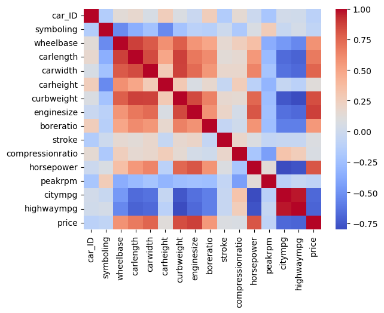
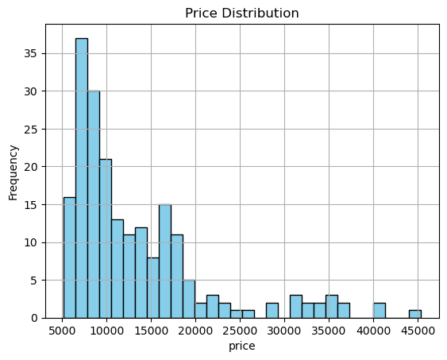
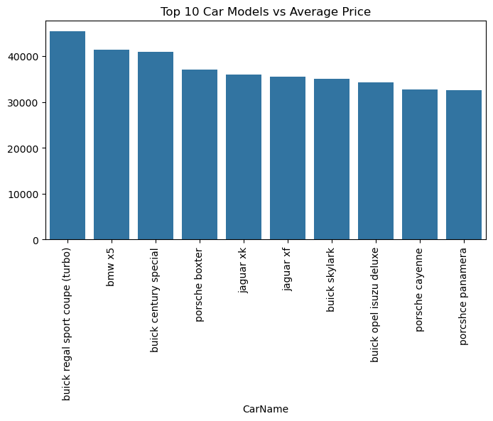
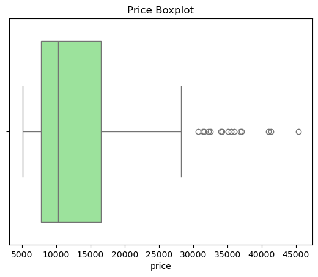
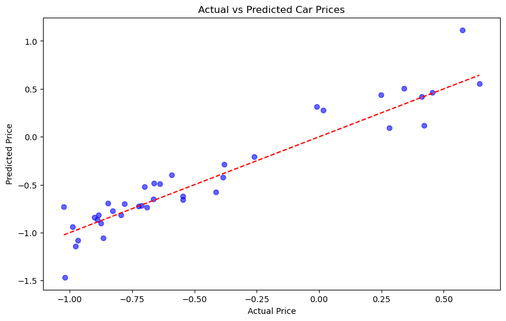
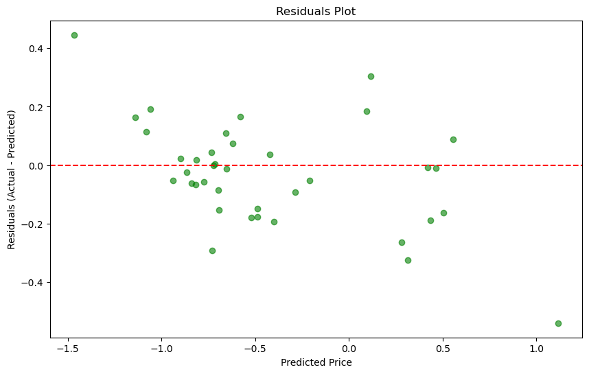

# 🚗 Car Price Prediction using Linear Regression

This project uses machine learning techniques to predict car prices based on a variety of features from the Kaggle Car Price dataset. The model is built using the **Linear Regression** algorithm and includes a complete data science workflow from EDA to model evaluation.

---

## 📁 Project Structure

├── LinearRegression_CarPricePrediction.ipynb # Main notebook file
├── README.md # This file
├── CarPricePredictionUsingLinearRegressionDocumentation.pdf # Project documentation
├── /plots # Folder for visualizations

---

## 🧠 Features

- Complete EDA (Exploratory Data Analysis)  
- Data preprocessing (null check, encoding, scaling)  
- One-hot encoding for categorical variables  
- Linear Regression model training and evaluation  
- Evaluation metrics: MAE, MSE, RMSE, R²  
- Visualization support for understanding data and predictions  

---

## 📦 Dataset

- **Source:** Kaggle Car Price Prediction Dataset  
- **Target Column:** `price`  
- **Type:** Regression  

---

## 🛠️ Tools and Libraries

- Python  
- Pandas  
- NumPy  
- Matplotlib  
- Seaborn  
- Scikit-learn  

---

## 📊 Evaluation Metrics

- Mean Absolute Error (MAE)  
- Mean Squared Error (MSE)  
- Root Mean Squared Error (RMSE)  
- R² Score  

---

## 📌 How to Run

1. Clone this repository  
git clone https://github.com/yourusername/CarPricePrediction-LinearRegression.git cd CarPricePrediction-LinearRegression

2. Open `LinearRegression_CarPricePrediction.ipynb` in Jupyter Notebook or Google Colab  

3. Run the cells step-by-step  

---

## 📈 Sample Outputs

---

## ✍️ Author

- [Abedini]([https://github.com/yourusername](https://github.com/Abedini81))

---

## ⭐ Star this repo if you found it helpful!
